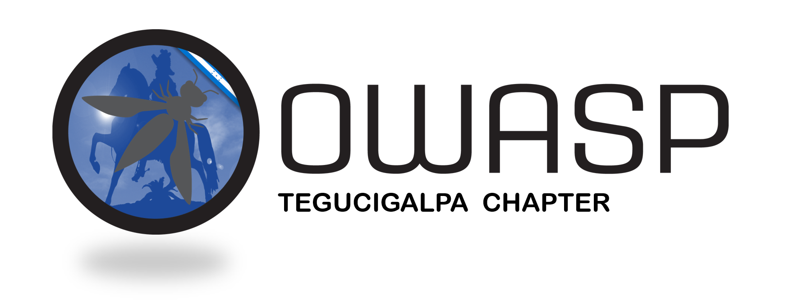

---

layout: col-sidebar
title: OWASP Tegucigalpa
tags: OwaspTGU
level: 0

region: Latin America

<!--auto-migrated: 1

---

 

  

 

## Bienvenidos
El capítulo local “OWASP Tegucigalpa” tiene como principal objetivo compartir conocimiento, experiencias, técnicas, enseñanzas y todo aquello que aporte para que nuestra región siga creciendo y se encuentre a la vanguardia en temas relacionados a la Ciberseguridad. 

## Reuniones

- Eventos de OWASP.

## Talleres

- Hacking Ético.
- Análisis de vulnerabilidades.
- OSINT (Open Source Intelligence).
- Seguridad en aplicaciones web.
- Seguridad en infraestructura tecnológica.

## Tú también puedes colaborar
Apoyando las iniciativas de nuestro capítulo, como son:
- Participando y aportando nuevas ideas a través de nuestra lista de correo o redes sociales.
- Asistiendo a los talleres y conferencias.
- Promoviendo el capítulo y el proyecto OWASP.

## Nuestras redes sociales
En nuestras redes sociales, compartimos recursos educativos y de interés. También te puedes enterar de nuestras reuniones y eventos en:

- [Facebook](https://www.facebook.com/OWASPTGU/)
