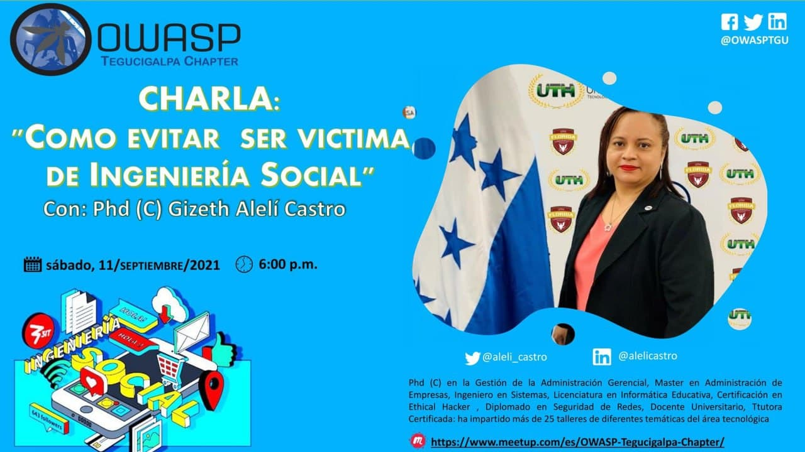

## Eventos 2021
### Taller: #TechTalk: API con NestJS y las Maravillas de TS
 

  

 
 
Taller: API con NestJS y las Maravillas de TS impartido por la Ing. Lidia Canales: 
-Ingeniera en Electronica 
-Desarrolladora de Frontend, Backend, Aplicaciones de pruebas E2E, Unit testing y despliegue de aplicaciones. 
-Voluntaria en proyectos medioambientales y de educacion escolar. 
-Directora de Geek Girls Latam Honduras 
-Miembro de JCI 
 
<table width="100%" border="1" style="text-align:center;">
  <tr>
    <th width="10%">Hora</th>
    <th width="18%">Fecha</th>
     <th width="18%">Expositor</th>
     <th width="20%">Título Charla</th>
     <th width="18%">Enlace</th>
  </tr>
  <tr>
    <td>18:00-19:00</td>
    <td>Sabado 2 de octubre</td>
    <td><b>Lidia Canales</b></td>
    <td>Taller: #TechTalk: API con NestJS y las Maravillas de TS</td>
    <td>https://www.meetup.com/OWASP-Tegucigalpa-Chapter/events/280834015/</td>
  </tr>
</table>
 
 
### Programando con ReactJS: Creando Componentes Reutilizables
 

  

 
 
Charla Programando con ReactJS impartida por la Ing. Kensy Ayala: 
-Ingeniera Informática 
-Miembro de DevTeam504 
-Experiencia en Soporte técnico y helpdesk 
-Frontend & Backend Developer 
-Angular and React lover 
 
<table width="100%" border="1" style="text-align:center;">
  <tr>
    <th width="10%">Hora</th>
    <th width="18%">Fecha</th>
     <th width="18%">Expositor</th>
     <th width="20%">Título Charla</th>
     <th width="18%">Enlace</th>
  </tr>
  <tr>
    <td>18:00-19:00</td>
    <td>Sabado 28 de agosto</td>
    <td><b>Kensy Ayala</b></td>
    <td>Programando con ReactJS: Creando Componentes Reutilizables</td>
    <td>https://www.meetup.com/OWASP-Tegucigalpa-Chapter/events/279837235/</td>
  </tr>
</table>
 
 
### Como Evitar Ser Victima de Ingenieria Social
 

    

 
 
Charla "Como Evitar Ser Victima de Ingenieria Social" impartida por la Phd (C) Gizeth Aleli Castro.
-Phd (C) en la Gestion de la Administracion Gerencial 
-Master en Administracion de Empresas 
-Ingeniero en Sistemas 
-Licenciatura en Informatica Educativa 
-Certificacion en Ethical Hacker 
-Diplomado en Seguridad de Redes 
-Docente Universitario 
-Tutora Certificada 
 
<table width="100%" border="1" style="text-align:center;">
  <tr>
    <th width="10%">Hora</th>
    <th width="18%">Fecha</th>
     <th width="18%">Expositor</th>
     <th width="20%">Título Charla</th>
     <th width="18%">Enlace</th>
  </tr>
  <tr>
    <td>18:00-19:00</td>
    <td>Sabado 11 de Septiembre</td>
    <td><b>Gizeth Aleli Castro</b></td>
    <td>Como Evitar Ser Victima de Ingenieria Social</td>
    <td>https://www.meetup.com/OWASP-Tegucigalpa-Chapter/events/279837287/</td>
  </tr>
</table>
 
 
### Auth0: Acceso seguro para todos
 

  

 
<b>Auth0 es una plataforma de autenticación y autorización adaptable.</b>
 
Charla impartida por el Ing. Christian Sanchez: 
-Software Developer y Auth0 Ambassador 
-Co-Fundador & Organizador Comunidad @DevTeam504 
-Co-Organizador Comunidad Flutter Honduras y Lead en Google Developer Student Club Unah-Vs. 
 
<table width="100%" border="1" style="text-align:center;">
  <tr>
    <th width="10%">Hora</th>
    <th width="18%">Fecha</th>
     <th width="18%">Expositor</th>
     <th width="20%">Título Charla</th>
     <th width="18%">Enlace</th>
  </tr>
  <tr>
    <td>16:00-17:00</td>
    <td>Sabado 14 de agosto</td>
    <td><b>Christian Sanchez</b></td>
    <td>Auth0: Acceso seguro para todos</td>
    <td>https://www.meetup.com/OWASP-Tegucigalpa-Chapter/events/279682660/</td>
  </tr>
</table>
 
 
## Eventos 2020
 
### INNOVATE 4.0 "APRENDIZAJE E INNOVACIÓN"
En el mes de la concientización sobre la ciberseguridad apoyaremos a la facultad de ingeniería en ciencias de la computación a su evento anual INNOVATE 4.O "Aprendizaje e Innovación".

   

   

 
<table width="100%" border="1" style="text-align:center;">
  <tr>
    <th width="18%">Panel</th>
    <th width="18%">OWASP San Pedro Sula</th>
    <th width="18%">OWASP Tegucigalpa</th>
    <th width="18%">OWASP Tegucigalpa</th>
  </tr>
  <tr>
    <td>OWASP Honduras</td>
    <td>Armando Reniery Rodas</td>
    <td>Kevin Mejía</td>
    <td>Francisco Moncada</td>
  </tr>
</table>
 
<table width="100%" border="1" style="text-align:center;">
  <tr>
    <th width="15%">Fecha</th>
    <th width="15%">Hora</th>
    <th width="15%">Modalidad</th>
    <th width="15%">Youtube</th>
    <th width="15%">Facebook</th>
  </tr>
  
### Datos del Evento: 
  <tr>
    <td>26 de octubre</td>
    <td>02:00pm Hora Honduras</td>
    <td>Transmisión en vivo</td>
    <td>https://bit.ly/2GOWVCa</td>
    <td>https://bit.ly/2IgpOrB</td>
  </tr>
</table>
 

 
### Conferencia de Concientizacion sobre La Ciberseguridad.
 

   
    

Organizado por:
-La Carrera de Pedagogia de la Universidad Nacional Autonoma de Honduras UNAH.
-Asignatura Taller de Practica Profesional Supervisada III.  [Presentaciones](https://drive.google.com/drive/folders/1VZItjf5UNOVufusmCMlJl4Io8mmJAHyk?usp=sharing
)
 
 
 
### Capacitacion Docentes UTH:Ciberseguridad .
 

   
    

El dia 3 del mes de septiembre del 2020, se realizo una capacitacion a los docentes del area de Informatica de la Universidad Tecnologica de Honduras(UTH). [Presentaciones](https://drive.google.com/drive/folders/1heBS5tDXwYZLfuSroPo8ufkEFWp7ERkg?usp=sharing
)
 
 

### Charla para la Escuela Happy Summer School sobre el Ciberbullying y Riesgos de las Redes Sociales .
 

   
    
   
    
   
    

El dia 30 del mes de julio del 2020, se realizo una charla a los padres de familia de los estudiantes de la escuela Happy Summer School, esta charla tenia como fin el de concientizar a los padres sobre los riesgos de las redes sociales y los efectos/consecuencias del ciberbullying.
 
 
### Taller de Ethical Hacking y Ciberseguridad
 

   

Durante el mes de julio del 2020, aportaremos a la comunidad de estudiantes del Centro Universitario Tecnológico (CEUTEC) con una serie de talleres que tienen como objeto el apoyo en su desarrollo profesional.
 
<table width="100%" border="1" style="text-align:center;">
  <tr>
    <th width="10%">Horas</th>
    <th width="18%">Sabado 4</th>
    <th width="18%">Sabado 11</th>
    <th width="18%">Sabado 18</th>
    <th width="18%">Sabado 25</th>
  </tr>
  <tr>
    <td>18:00-21:00</td>
    <td><b>Kevin Mejía</b>: Explotación de vulnerabilidades en entornos Windows y Linux </td>
    <td><b>Raúl Aguilar</b>: Introducción a la ciberseguridad y gestión de vulnerabilidades</td>
    <td><b>Gerardo Gomez</b>: Web Hacking 101</td>
    <td><b>Armando Rodas</b>: Mobile Hacking 101</td>
  </tr>
</table>
 
### OWASP LATAM at HOME 2020
 

  

 
Durante la gira de [OWASP LATAM at Home 2020](https://owasp.org/www-event-2020-latam-at-home/) participamos como capítulo de Latinoamérica, con las siguientes conferencias:
 
 
 
<table width="100%" border="1" style="text-align:center;">
  <tr>
    <th width="10%">Horas</th>
    <th width="18%">Lunes 4</th>
    <th width="18%">Martes 5</th>
    <th width="18%">Miércoles 6</th>
    <th width="18%">Jueves 7</th>
    <th width="18%">Viernes 8</th>
  </tr>
   <tr>
    <td>18:00-18:45</td>
    <td>-</td>
    <td>-</td>
    <td>-</td>
     <td><b>Sandy Palma</b>: La Gobernanza de la Información</td>
    <td>-</td>
  </tr>
  <tr>
    <td>18:40-19:20</td>
    <td>-</td>
    <td>-</td>
    <td><b>Raúl Aguilar</b>: Security Knowledge Framework</td>
    <td>-</td>
    <td>-</td>
  </tr>
  <tr>
    <td>19:20-20:00</td>
    <td>-</td>
    <td>-</td>
    <td><b>Armando Rodas</b>: OSINT, Técnicas de Reconocimiento en un Test de Intrusión</td>
    <td>-</td>
    <td>-</td>
  </tr>
</table>

## Presentaciones:
[Sandy Palma- La Gobernanza de la Informacion](https://drive.google.com/open?id=11F5ARGu7_9bf0vBYfVUmc8I0M_AkQvMQ)

### Taller de Ethical Hacking y Ciberseguridad
 

 
Durante el mes de julio del 2020, aportaremos a la comunidad de estudiantes del Centro Universitario Tecnológico (CEUTEC) con una serie de talleres que tienen como objeto el apoyo en su desarrollo profesional.
 
<table width="100%" border="1" style="text-align:center;">
  <tr>
    <th width="10%">Horas</th>
    <th width="18%">Sabado 4</th>
    <th width="18%">Sabado 11</th>
    <th width="18%">Sabado 18</th>
    <th width="18%">Sabado 25</th>
  </tr>
  <tr>
    <td>18:00-21:00</td>
    <td><b>Kevin Mejía</b>: Explotación de vulnerabilidades en entornos Windows y Linux</td>
    <td><b>Raúl Aguilar</b>: Introducción a la ciberseguridad y gestión de vulnerabilidades</td>
    <td><b>Gerardo Gomez</b>: Web Hacking 101</td>
    <td><b>Armando Rodas</b>: Mobile Hacking 101</td>
  </tr>
</table>
 
      

## Eventos 2019
### OWASP NIGHTS 2019
### OWASP LatamTour 2019

   
